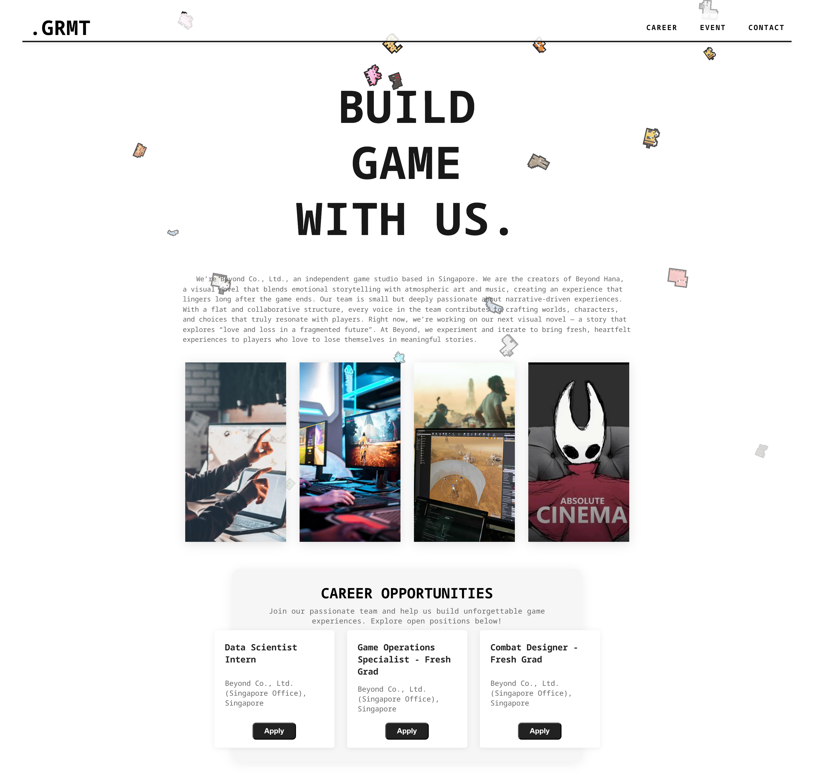
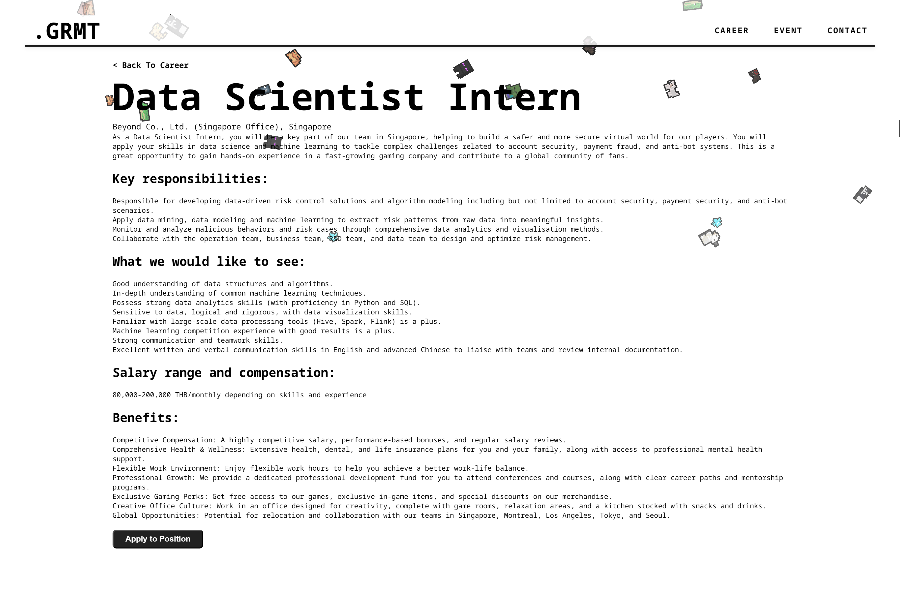
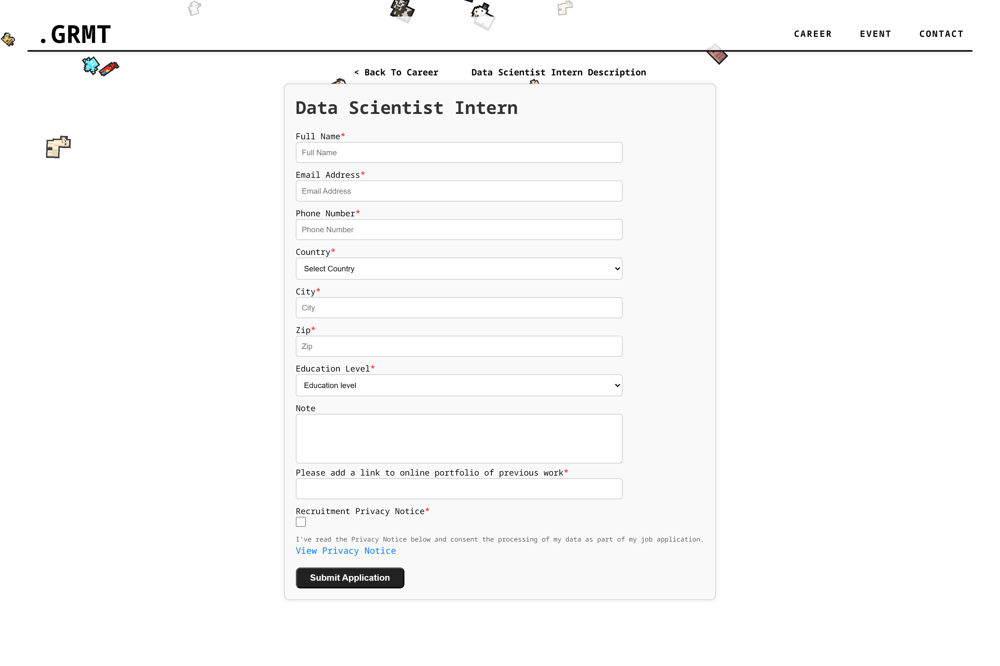
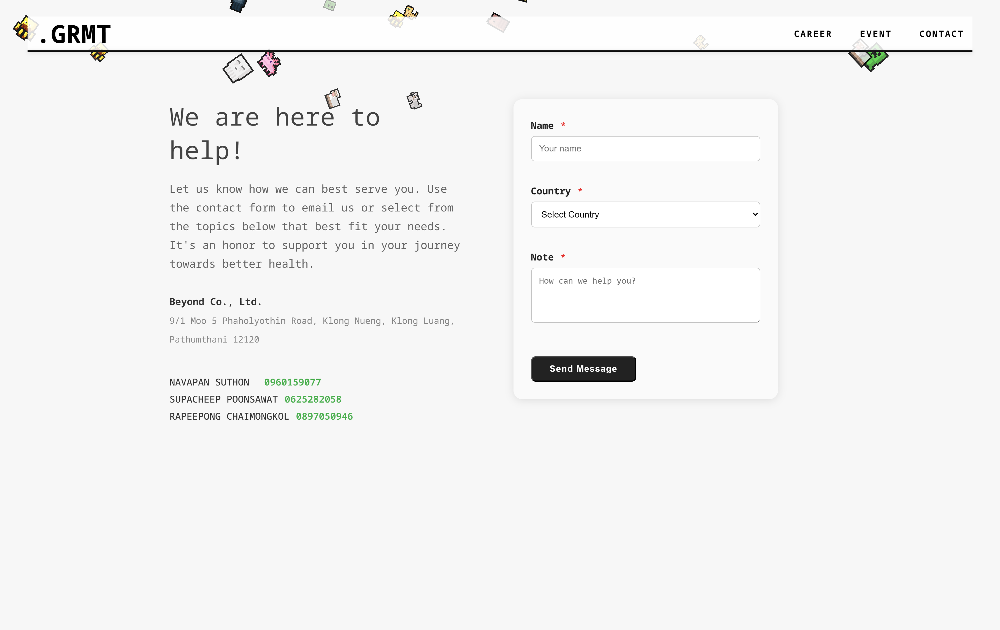

# 🎮 Game Company Career Web – Playful Prototype

A playful prototype for a game company career web, designed for fun and developer practice. This project focuses on UI/UX prototyping and is not a production-ready application.

---

## 📝 Overview

This project simulates a career site for a fictional game company, inspired by real-world studios. The site includes:

- ✨ Landing page with company intro and animated visuals
- 📋 Job openings & career cards
- 📄 Detailed job description page
- 📨 Job application form
- 📞 Contact page

> **Role:**  
> UX/UI Designer & Frontend Developer

---

## 🖼️ Screenshots

### 🏠 Home / Landing Page



### 📄 Job Description



### 📝 Application Form



### 📞 Contact Page



---

## 🚀 Features

- Modern, playful UI with decorative animated elements 🎉
- Responsive layout for desktop and tablet 📱💻
- Career listings with mock data and application forms 🧑‍💻
- Contact form with company info 📨

---

## 🛠️ Tech Stack

- **Frontend:** (please fill in, e.g. React / Next.js / Vue / etc.)
- **Styling:** (please fill in, e.g. TailwindCSS / SCSS / etc.)
- **Assets:** Custom illustrations & UI elements

---

## ▶️ Usage

1. Clone this repository
2. Install dependencies
3. Run the project locally  
   *(Add specific commands here, e.g. `npm install && npm run dev`)*

---

## 🎯 Project Goals

- Practice and showcase frontend & UI/UX skills
- Prototype a fun, interactive career web experience
- Not intended for production or real job applications

---

## 👤 Credits

Created by **etsuwithtea**  
Role: UX/UI Designer & Frontend Developer

---

## 📄 License

For learning and demonstration purposes only.

---

```
**Note:**  
All images and assets are for demo/prototype use only.
```
